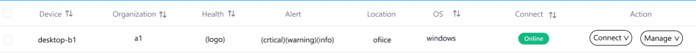
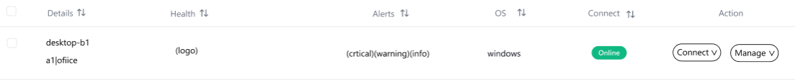
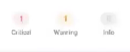

# Machine Module

The project uses NextJS

Default front-end libraries are Shadcn, Tanstack/query, Tanstack/Table, Recharts.

If you need to add new dependent libraries (e.g. charts), you need to let us know and discuss them in advance.

This section should support both mobile and computer displays.

## Table/Column View

Should be able to display at least: device name, organization/location affiliation, health status, alarms, connection status.

Example 1.

Example 2.

Critical, Warning, Info logo

  

There should be an entry point to the Details page.

## Details Page

### Information to be displayed

In addition to the basic information available on the home page, more detailed information needs to be displayed (**The following information is retrieved by the Agent or database**):

For example, device details (device name, memory capacity, CPU, CPU hardware information).

Firewall status, AntilVirus status, network IP (intranet and extranet), open ports, system logs

Windows systems should also show serial numbers

Show warnings by time, scripts running (Activity Log)

If the device has a GUI, it needs to be able to display the current device screen.

Note information about the device

### Required Configuration

Buttons/interfaces for remote desktop (AnyDesk, Teamviewer, RustDesk) access.

Window to display device's hard disk usage, software installations (management of sources such as apt, winget), processes running.

Windows needs to be able to display service registrations and patch installations.

Enable CLI for the current terminal through a window